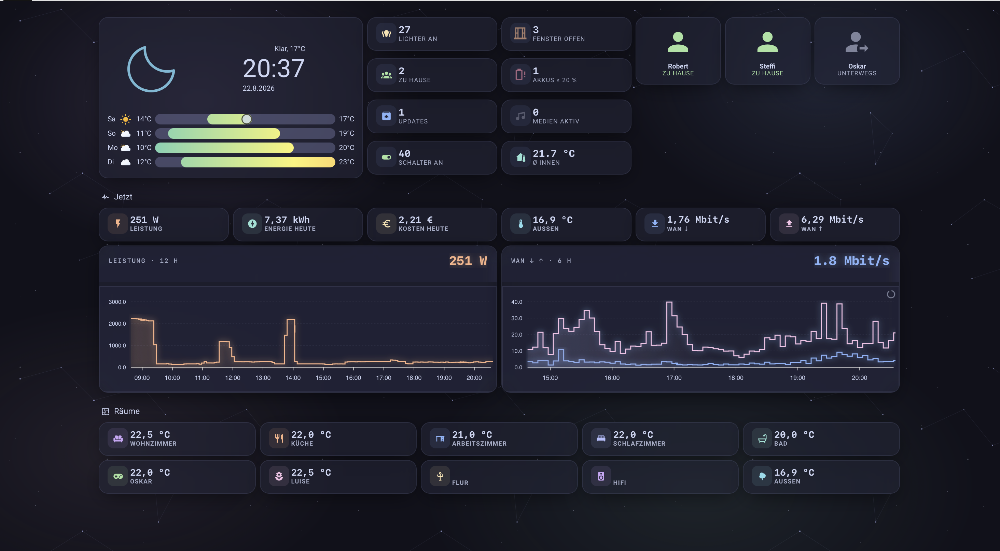

# ✨ Aurora Dashboard

**A dark, animated mission-control dashboard for Home Assistant.**
Glass cards over an animated constellation sky, neon-glow charts with a travelling
scan pulse, animated buttons — and an *Explorer* view that surfaces **every single
sensor** in your installation, grouped by device class, with zero configuration.

> Catppuccin-Mocha palette · one view per room · auto-discovering · no expensive backend templates



## Highlights

- 🌅 **A sky that follows the sun, the weather and the season** — three
  hand-drawn full-screen scenes (**Day**, **Dusk**, **Night**) that switch with
  the real sun elevation or from a visible four-button row.
  - The sun sits **where it actually stands**: azimuth drives its horizontal
    position, elevation its height.
  - The sky **reflects the weather at your location**: the palette follows the
    condition, the **number of clouds follows the cloud cover**, their **speed
    follows the real wind**, and rain, snow, fog and lightning are drawn on top
    while the sun fades out behind thick cover.
  - At night the **moon is where the moon actually is** — its position is
    computed from your installation's own latitude and longitude, it travels
    across the sky as the night goes on, and it is drawn with its **true
    phase**: the lit part is a computed lune, so a waxing crescent looks like
    one. Hover it for the phase name and the illuminated percentage.
  - The ground is a **meadow that follows the season** — fresh green with
    spring flowers, deep green with poppies in summer, golden with falling
    leaves in autumn, snow-covered in winter. Plus a tree line on the horizon,
    swaying grass, birds on calm days and fireflies on summer nights.
  - Everything is CSS gradients and SVG shapes drawn for this project;
    **no third-party artwork, no image files, nothing to license**.
- 🚦 **House traffic light** — one card at the top that shows what needs
  attention instead of what is always the same: a window open while that room
  is heating, low batteries, a device fault, laundry finished, lights on with
  nobody home, unusual power draw, pending updates. When nothing is pending it
  says *All clear* and stops pulsing.
- 📈 **Per-room trends** — every room view ends with actual-vs-target
  temperature and valve position over 24 h, drawn with a grid, a time axis
  (`−24 h … now`), value labels, and min/max with unit and time. Charts placed
  next to each other are the same height whether or not they carry a legend.
- 🌌 **Animated constellation background** — fine star-lines drifting and twinkling
  behind everything (pure CSS + inline SVG, respects `prefers-reduced-motion`).
- 📈 **Mission-control plots** — monospace label, big glowing live value, neon
  step-line with gradient fill, and an animated **scan pulse** running along the curve.
- 🔘 **Animated buttons** — lights breathe amber when on, switches glow green,
  open windows pulse orange, low batteries pulse red.
- 🏠 **One view per room** — each room gets its own tab with three columns:
  climate (thermostat dial, setpoint slider, valve position, battery tiles,
  window state), light + scenes, and switches + media + automations. Lights,
  scenes, switches and automations are discovered **by area**, so assigning
  entities to areas in Home Assistant is all the setup there is. A light
  overview tab shows the key figures and links into each room.
- 🤖 **Automations everywhere** — every automation appears as a toggle tile
  (green robot wobbling when active, grey when off), both inside its room and
  on a dedicated Automations view together with scripts and helpers.
- ✨ **Every icon animates** — lights breathe and flicker, scenes shimmer with
  staggered delays, valves spin faster the wider they open, robots wobble,
  batteries blink when low, radar sweeps rotate. All from one shared keyframe
  library, all silenced by `prefers-reduced-motion`.
- 📡 **Radio view** — BLE scanner cards with a **rotating radar sweep**, every
  `signal_strength` sensor auto-discovered as a traffic-light dBm tile
  (pulses red when weak), and RSSI history charts.
- 🧊 **Real glass** — cards get a strong backdrop blur plus a diagonal light
  sheen and top-edge highlight, injected by the effects helper.
- 🔭 **Sensor Explorer** — *every* sensor and binary sensor in your install,
  grouped by device class, sorted, auto-discovered. Nothing falls through.
- ⚡ **Live counter chips** — lights on, windows open, updates pending, people
  home, low batteries … computed client-side in the browser.
- 🛡 **Performance-safe by design** — there is deliberately **not a single Jinja
  card template** in this dashboard. All logic runs client-side (button-card JS,
  auto-entities patterns). Card templates with registry scans are re-rendered by
  Home Assistant on *every* state change and can bring a busy instance down;
  Aurora never does that.

## Requirements

Home Assistant 2024.11+ (sections views with `grid_options`). Install these
frontend cards (via HACS or manually):

| Card | Used for |
|------|----------|
| [button-card](https://github.com/custom-cards/button-card) | all animated tiles, chips, plot headers |
| [apexcharts-card](https://github.com/RomRider/apexcharts-card) | the analysis charts (Energy, Network, Radio, Overview) |
| [mini-graph-card](https://github.com/kalkih/mini-graph-card) | the per-room trend charts — see the Safari note under *Performance* |
| [auto-entities](https://github.com/thomasloven/lovelace-auto-entities) | auto-discovery (lights, batteries, explorer …) |
| [stack-in-card](https://github.com/custom-cards/stack-in-card) | seamless plot tiles |
| [mushroom](https://github.com/piitaya/lovelace-mushroom) | climate + media cards |
| [clock-weather-card](https://github.com/pkissling/clock-weather-card) | hero clock/weather |

**No card-mod required.** The glass blur and the scan-pulse animation come from
the bundled `dist/aurora-effects.js` (a small dependency-free helper).

## Easy install (one click)

**Effects helper via HACS:**

[](https://my.home-assistant.io/redirect/hacs_repository/?owner=robeertm&repository=aurora-dashboard&category=plugin)

This adds the repo to HACS and installs `aurora-effects.js` including the
dashboard resource — one click, then "Download".

**Theme + dashboard in one command** — SSH into Home Assistant and run this
inside `/config`:

```sh
curl -fsSL https://raw.githubusercontent.com/robeertm/aurora-dashboard/main/install.sh | sh
```

It places the theme, the effects helper, and `aurora-dashboard.yaml` and prints
the two remaining UI steps.

## Manual install

1. **Theme** — copy `themes/aurora.yaml` into your `config/themes/` folder
   (with `frontend: themes: !include_dir_merge_named themes`), then call the
   `frontend.reload_themes` action.
2. **Effects helper** — copy `dist/aurora-effects.js` to
   `config/www/aurora-effects/aurora-effects.js` and register it as a dashboard
   resource: `/local/aurora-effects/aurora-effects.js` (type *module*).
3. **Dashboard** — create a new dashboard and paste `dashboard/aurora.yaml`
   into its raw configuration editor. Set the *Aurora* theme on each view (the
   shipped YAML already does).
4. **Adapt the entities** — most of the dashboard auto-discovers, only the hero
   metrics and charts reference concrete entities. Search the YAML for these and
   replace them with yours:

   | Placeholder in YAML | Meaning |
   |---------------------|---------|
   | `weather.forecast_home` | your weather entity |
   | `sensor.total_power` | current house power (W) |
   | `sensor.total_energy_today` | energy today (kWh) |
   | `sensor.total_cost_today` | cost today |
   | `sensor.outdoor_temperature` | outdoor temperature |
   | `sensor.wan_download_rate` / `sensor.wan_upload_rate` | live WAN throughput |
   | `sensor.wan_download_today` … | WAN volume counters (MB) |
   | `sensor.room_temp_*` | one temperature sensor per room |
   | `climate.trv_*` | one thermostat (TRV) per room — Smart Home view |
   | `binary_sensor.window_*` | window contact per room — Smart Home view |
   | `sensor.trv_*_valve` / `sensor.trv_*_battery` | valve position + battery per room (optional) |
   | `input_number.room_setpoint_*` | optional room-setpoint helper shown as a slider |
   | `media_player.*` | one media row per room (optional) |
   | `sensor.ble_scanner_*` | optional BLE scanner metrics (adverts / unique devices / avg RSSI) — Radio view; the signal-tile grid works without them |
   | `input_select.sky_mode` | the sky switch — see below |

### The sky switch

The sky reads one helper. Create it in *Settings → Devices & services →
Helpers → Dropdown*, name it `sky_mode`, and give it exactly these four
options — or drop this into your `configuration.yaml`:

```yaml
input_select:
  sky_mode:
    name: Sky
    icon: mdi:theme-light-dark
    options: [Auto, Day, Dusk, Night]
```

On **Auto** the scene follows `sun.sun`: above 6° elevation is Day, down to
−8° is Dusk, below that Night. A row of four labelled buttons sits under the
status card on the Overview and Phone views — the active one lights up.
Nothing else is wired to the helper: no automation, no template sensor.

The weather comes from the entity named in the sky template's `weather`
variable (`weather.forecast_home` by default) — it reads the condition,
`cloud_coverage` and `wind_speed`. The season is derived from the month; set
the template's `season` variable to `spring`, `summer`, `autumn` or `winter`
to pin one.

   The **Smart Home** view is a copy/paste pattern: duplicate one room section,
   swap the climate entities, set the area name and accent color — the light,
   scene, switch and automation columns fill themselves from that area.
   Room *group* entities (e.g. a Hue room `light.living_room`) are excluded on
   purpose: they would light up in parallel with every single lamp and make the
   room look twice as busy as it is.

   Everything else (lights, switches, scenes, climate, windows, batteries, RSSI,
   trackers, updates, the whole Explorer) finds your entities by itself.

## The scan pulse

Charts get the travelling pulse by adding the same entity a second time as a
line series named exactly `scan`:

```yaml
series:
  - entity: sensor.total_power
    name: Power
    color: "#fab387"
  - entity: sensor.total_power
    name: scan          # <- aurora-effects.js animates any series named "scan"
    type: line
    color: "#fab387"
    stroke_width: 3
    show: { in_header: false, legend_value: false }
```

The glow comes from ApexCharts' native `chart.dropShadow` — see any chart in the
shipped YAML for the pattern.

## Performance notes

Everything below was measured with Chrome's `Performance.getMetrics` over 15 s
of idle time on a real installation (1450 entities), not guessed.

- **Keep views small.** One view holding every room measured **~73 % CPU while
  idle**; the same content split into one view per room runs at **9–29 %**. A
  browser pays for every card that exists, not just the visible ones — so
  splitting is by far the biggest lever.
- **Never inject the same CSS into every card.** Shadow DOM has no shared
  stylesheet unless you make one. Appending a `<style>` block per card put
  **428 kB of duplicated CSS in 175 stylesheets** into a single room view, all
  of it re-matched on every style recalculation; a shared constructable
  `CSSStyleSheet` adopted by each root brought that to **89 kB in 13**. The same
  applies to a button-card template's `extra_styles`: it is copied into every
  card that inherits it.
- **Do not iterate `hass.states` from a card template.** button-card hands the
  template a proxy, so `Object.values(hass.states)` is one trapped property read
  per entity — 1450 of them, per chip, per render, and a chip usually evaluates
  its text, its colour and its animation separately. Filter the *keys* by domain
  first and read only what survives: on the Overview that was **~46 % → ~20 %**
  idle CPU.
- **Test in WebKit, not only in Chrome.** Every browser on iOS *is* Safari —
  Apple requires WebKit there — so a dashboard that is smooth in Chrome can be
  unusable on an iPhone. Measured in real WebKit, a room view with 92 cards and
  four `apexcharts-card`s took **160 s to finish and scrolled at 4 fps**; the
  same view with the charts removed took 2.3 s. Each chart forces layout
  measurements while drawing, and WebKit re-lays-out the *whole* page for each
  one — so the cost is charts × page complexity, not charts + page. Four charts
  alone, in a view of their own, render in 1 s. Aurora therefore uses the much
  lighter **mini-graph-card** for the per-room trends and keeps apexcharts for
  the analysis views, where the charts *are* the content: **160 s → 4.7 s**,
  4 fps → 53 fps.
- **Phones need less, not smaller.** Under 700 px this dashboard drops the
  per-card backdrop blur (each blurred card is a compositing layer plus a
  backdrop snapshot, at 3× device pixels), freezes the sky's motion while
  keeping its picture, and stops idle decoration — while animations that carry
  meaning keep running. An animated icon delivered as an **SVG image** cannot be
  paused by CSS or JavaScript at all (it animates inside its own document), so
  swap the card itself behind a `conditional` card with a `screen` condition.
- **`triggers_update: all` is expensive.** A card with it re-renders on *every*
  state change anywhere in Home Assistant. 66 such cards produced 120 style
  recalculations per second. Bind cards to the entities they actually read.
- **Animation inside a glass card repaints the glass.** Animating `box-shadow`
  or `filter` in a card that has `backdrop-filter` forces the blur behind it to
  be recomputed every frame — a *single* permanently pulsing badge cost 9 % CPU
  on its own. Fixes used here: animate `transform`/`opacity` only, give animated
  elements their own layer with `will-change`, and only animate when the state
  actually says something (a window badge pulses when the window is open, not
  always).
- **The sky is free — but only because of how it is built.** Measured on the
  Overview: **Day ≈ 16 %, Night ≈ 23 %, Dusk ≈ 24 %** idle CPU, and switching
  every sky animation off live changed the figure by **0.4 %** — i.e. nothing
  outside the noise of live sensor data. The weather layers cost nothing
  either: sunny 24.9 %, overcast 19.4 %, **heavy rain 15.5 %**, snow 16.0 %,
  thunderstorm 21.0 % — the spread is measurement noise, not the animation.
  That holds only because each scene animates `transform`/`opacity`
  exclusively, drifts an oversized layer instead of a `background-position`,
  and never has more than one scene in the DOM. Animate a paint property there
  instead and every glass card on top of it has to re-blur on every frame.
- Animations on cards scrolled out of view are paused automatically
  (IntersectionObserver in the effects helper).
- Counter chips and button animations run entirely in the browser.
- `auto-entities` filters use include/exclude patterns only — **never** its
  `template:` filter (that would subscribe a backend template).
- If you add your own cards: put expensive Jinja (`integration_entities`,
  `device_entities`, `states.x` scans) into a *template sensor* with a time
  trigger, never onto a card. Cards re-render on every state change.

## License

Source-available, © Robert Manuwald: free to download and **use** on your own
Home Assistant installation (including adapting entity IDs to your setup).
Modification beyond that, redistribution, and derivative works are not
permitted — see [LICENSE](LICENSE).
